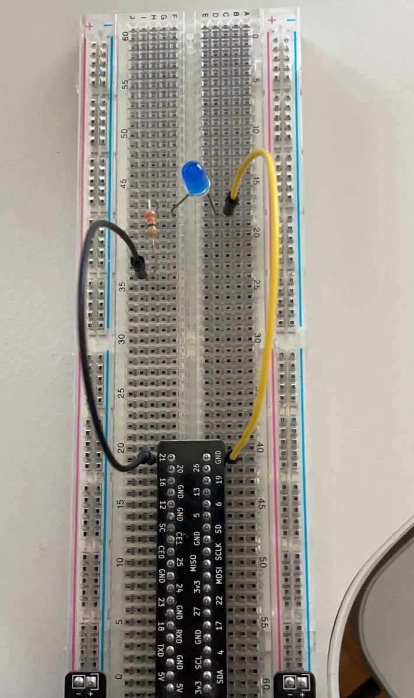

# RPi GPIO

A C++ interface for Raspberry PI based on [CppGPIO](https://github.com/JoachimSchurig/CppGPIO).


## Installation Instructions

To simplify the {,un,re}install process, use `cmake`, `cpack`, and `apt` to build the code and install it as a debian package. The simplest way to install this package is to use the following commands:

```bash
wget https://github.com/johnpatek/rpi-gpio/releases/download/v1.0.0/rpi-gpio-1.0.0.deb
sudo apt install ./rpi-gpio-1.0.0.deb
```

The package can also be built from source:

```bash
git clone https://github.com/johnpatek/rpi-gpio.git
cd rpi-gpio
mkdir build && cd build
cmake .. && make && cpack
sudo apt install ./rpi-gpio-1.0.0.deb
```


## Example

In this simple example, the LED will turn on, wait for 5 seconds, and then turn off.

In order to run this code, the following components are required:

+ 1 breadboard
+ 1 resistor(330 or 1K should be fine)
+ 2 wires
+ 1 LED

This example will use BCM pin 21, as pictured below:



Add the code to `main.cpp`:

```c++
#include <rpigpio/rpigpio.h>

int main(int argc, const char * argv[])
{
    GPIO::DigitalOut pin(21);

    pin.on();

    std::this_thread::sleep_for(std::chrono::seconds(3));

    pin.off();

    return 0;
}
```

Use the following commands to compile and run the code:

```bash
g++ main.cpp -lrpigpio -pthread
./a.out
```

Alternatively, this example can be built using cmake:

```bash
cp -r /usr/share/doc/rpi-gpio/demo ~
cd ~/demo
mkdir build && cd build
cmake .. && make
./blink 
```


### Version Numbering and Planned Changes

The current version is `1.0.0`.

New features planned(in no particular order):

+ [ ] Configurable BCM parameters to allow for older and newer GPIO pin layouts.
+ [ ] New syntax and API
+ [ ] Standardized process for testing

These changes have been planned entirely based on what the author would find useful. If you have specific needs that you would like supported, please [send the author an email](mailto://johnpatek2@gmail.com&subject=RPi%20GPIO%20Feature%20Request).


## Known Issues and Additional Information

This code has only been tested on a Raspberry Pi 3 Model B+. It is likely compatible with several versions of Raspbian OS, but this specific code was built and tested using "Buster". Hopefully these limitations can be addressed in future versions.